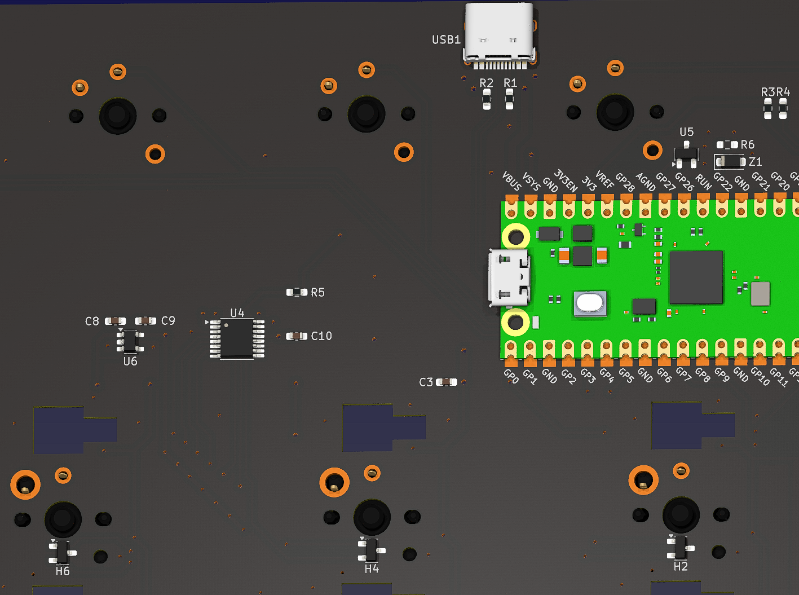

# IIDX Pico - Beatmania IIDX Style Mini Controller
[点这里可以切换到中文版](README_CN.md)

## Features
* Cool thin design.
* Three variants: IIDX Pico, IIDX Teeny, and IIDX Jumbo.
* Foldable with soft hinge.
* Now supports both Hall effect switches and mechanical switches.
* Customizable lights and effects.
* HID lights.
* All source files open.

## Change Notes
* IIDX Pico, IIDX Teeny, and IIDX Jumbo have been integrated into this repository for better management.
* The old IIDX Teeny repository has been archived and will be no longer updated.
* Old files have been moved to the Gen1Archive directory, but can also be found in the historical versions.

## Thanks
Thanks to many respectful guys/companies who made their tools or materials free or open source (KiCad, OnShape, InkScape, Raspberry things).

Special thanks to community projects and developers.
And also these projects:
* RP_Silicon_KiCad: https://github.com/HeadBoffin/RP_Silicon_KiCad
* Type-C: https://github.com/ai03-2725/Type-C.pretty

## My Other Projects
You can check out my other cool projects.

               

* Popn Pico: https://github.com/whowechina/popn_pico
* IIDX Pico: https://github.com/whowechina/iidx_pico
* IIDX Teeny: https://github.com/whowechina/iidx_teeny
* Chu Pico: https://github.com/whowechina/chu_pico
* Mai Pico: https://github.com/whowechina/mai_pico
* Diva Pico: https://github.com/whowechina/diva_pico
* AIC Pico: https://github.com/whowechina/aic_pico
* Groove Pico: https://github.com/whowechina/groove_pico
* Geki Pico: https://github.com/whowechina/geki_pico
* Musec Pico: https://github.com/whowechina/musec_pico
* Ju Pico: https://github.com/whowechina/ju_pico
* Bishi Pico: https://github.com/whowechina/bishi_pico
* Nos Pico: https://github.com/whowechina/nos_pico
* Voltex Pico: https://github.com/whowechina/voltex_pico
* Chord Pico: https://github.com/whowechina/chord_pico

## **Disclaimer** ##
I made this project in my personal time with no financial benefit or sponsorship. I will continue to improve the project. I have done my best to ensure that everything is accurate and functional, there's always a chance that mistakes may occur. I cannot be held responsible for any loss of your time or money that may result from using this open source project. Thank you for your understanding.

## About the License
It's CC-NC. So DIY for yourself and for your friend, don't make money from it. And plagiarism that doesn’t even dare to mention the original author is not acceptable. Please note that pooling orders and group buying for raw materials is acceptable.Selling any leftover components at cost (without profit) is also acceptable.

If you're interested in buying from me, or for commercial use, please contact me (Discord, QQ group, Goofish).
* My Discord Invitation: https://discord.gg/M8f2PPQFEA
* QQ Group: 854535476
* Goofish: whowe12345

## HOW TO BUILD
### Turntable Materials
* 1x 5mm\*2mm magnet (must be radially magnetized).
* 1x 61804-2RS deep groove ball bearing (20x32x7mm), just choose the cheaper ones.
* 2x 6705-2RS (alternative) deep groove ball bearings (25x32x4mm) for IIDX Jumbo, less wobbling.
* 1x WS2812B LED strip. Go with ones with dense LED configurations. I recommend 80 LEDs per meter or higher for IIDX Pico and IIDX Jumbo; 120 LEDs per meter or higher for IIDX Teeny;
* 1x M2.5*6 screw and hex nut, to fix disc seat, magnet seat and bearing together.
* 4x M3*8mm screws, to fix bearing seat to the base.
* 4x M3*12mm screws, for the disc. 
* 2x M3*8mm screws and hex nuts, for the banner.
* 1x Custom cut black acrylic disc, 3mm thickness for IIDX Pico and IIDX Jumbo.
* Some 10mm non slip self-adhesive silicon pads (also for Keyboard).
* Silicone tube, inner diameter 25mm, outer diameter 27mm, serves as a hinge.
* Some soft ribbon cable with 7 wires, silicone 28AWG is recommended.
* Some acetate cloth tape helps to fix the wires.

### PCB and Keyboard Materials
* 1x Raspberry Pi Pico.  
  https://www.raspberrypi.com/products/raspberry-pi-pico
* 11x Kailh Choc v1 or v2 key switches, I suggest using linear switches for the 7 main buttons.  
  https://www.kailhswitch.com/mechanical-keyboard-switches/low-profile-key-switches/burnt-orange-switch.html  
  https://www.kailhswitch.com/mechanical-keyboard-switches/key-switches/kailh-low-profile-switch-choc-v2.html
* 7x Kailh 2.0U low-profile stabilizers.  
  https://chosfox.com/products/kailh-1350-choc-switch-6-25u-stabilizer-set
* 2x Panasonic EVQP1K05M square tactile switches for IIDX Pico and IIDX Jumbo.  
  https://www3.panasonic.biz/ac/e/dl/catalog/index.jsp?series_cd=3473&part_no=EVQP1K05M
* 6x Panasonic EVQP1K05M or ALPS SKPMAPE010 square tactile switches for IIDX Teeny.  
  https://www3.panasonic.biz/ac/e/dl/catalog/index.jsp?series_cd=3473&part_no=EVQP1K05M  
  https://tech.alpsalpine.com/e/products/detail/SKPMAPE010/
* 1x USB Type-C socket (918-418K2023S40001 or KH-TYPE-C-16P)
* 1x AS5600 (SOP8) or TMAG5273 (SOT23-6) hall angular sensor chip.
* RGB LEDs
  * IIDX Pico and IIDX Jumbo (nicer light effect version)
    * 28x WS2812B-1516 or WS2812B-2020 for main buttons, pinout should be exactly like this:  
    
    * 4x WS2812B-3528 (or WS2812B-2835), for AUX buttons.
  * IIDX Pico and IIDX Jumbo (easier soldering version)
    * 11x WS2812B-3528 (or WS2812B-2835), forget about ridiculously tiny 28x LEDs.
  * IIDX Teeny
    * 18 WS2812B-3528 (or WS2812B-2835).
* 4x 0603 5.1kohm resistors for USB and I2C.
* 6x 0603 0.1uF capacitors for IIDX Pico and IIDX Jumbo, 4x for IIDX Teeny.
* 4x Kailh low-profile keycaps for IIDX Pico and IIDX Jumbo.
* 4x M3*8mm screws and hex nuts to fix parts together.

### If you want to build Hall Effect version
* WS2812B-3528 per switch is no longer an option. Because it conflicts with the pinout.
* 1x ADG708BRUZ, 8 to 1 analog switch, in TSSOP-16 (U4).
* 1x LP5907MFX-4.5 or TPS7A2042PDBVR LDO, in SOT23-5 (U6), see next line.
* 1x LM4040 shunt voltage reference, get one with 2.0~2.1V (for 4.2V LDO) or 2.2~2.5V (for 4.5V LDO) reference voltage, in SOT23-3 (U5).
* 7x SS49E or compatible linear Hall Effect sensors, in SOT23-3 (H1-H7).
* 1x 10ohm resistor, 0603 (R5) and leave R6 absent.
* 1x 3.3V Zener diode, in SOD-123 or SOD-123F, such as BZT52H-C3V3 (Z1).
* 7x low profile magnetic switches, Gateron/NuPhy Jade Mini or Jade Pro Mini, Kailh Star Magnetic Mini, or compatible ones. (SW1-SW7).
* Some more 0.1uF capacitors. (All remaining capacitor positions).
* This shows the soldering for Hall Effect version.  
  

### Step 1 - Buy
* Main PCB  
  Just go [JLC](https://jlcpcb.com/) or some other PCB vendor you like and make the order. Make sure the board thickness is **1.2mm**, it's very important!
* Acrylic disc for IIDX Pico and IIDX Jumbo  
  Find a vendor to cut a 3mm thick black acrylic using corresponding DXF file.  
  You can 3D print a turntable disc, but it is prone to heat deformation.

### Step 2 - 3D Print
#### Keyboard
For following prints, FDM, PLA, 0.4 nozzle, 0.2mm layer.
* Keyboard base ("Keyboard Base *.stl), PLA/PETG transparent, 2 to 3 walls.
* Keyboard panel ("Keyboard Panel.stl"), PLA/PETG transparent, 2 to 3 walls. Please render the panel art and text (height 3mm+) in black if you have multi-color printing system.

#### Turntable 
For following prints, FDM, PLA, 0.4 nozzle, 0.2mm layer, 3 to 4 walls.
* Base ("Turntable \* - Base.stl"), 20-40% infill.
* Bearing seat ("Turntable - Bearing Seat"), 40% to 60% infill.
* Magnet seat ("Turntable - Magnet Seat"), 40% to 60% infill.
* Disc seat ("Turntable - Disc Seat"), 40% to 60% infill.
* For IIDX Teeny only, the disc ("Turntable Teeny - Disc"), 80%+ infill, use a textured PEI bed and concentric pattern for a better surface.
* Banner ("Turntable * - Banner"), 20-40% infill. You can render the text in black if you have multi-color printing system.
* NOTE: IIDX Jumbo with 2 bearings is abbreviated as "Jumbo 2B" in the file name.

#### Button keycaps
* Keycap ("Keycap *.stl", choose the one matches your build), resin printing is recommended, but FDM can work in a pinch.

### Step 3 - Soldering and Assembly Tips
* Keyboard
  * It's very easy to miss two USB pins of the Raspberry Pico Pi, it's at the other side. It's difficult to solder as you may leave air bubbles in the soldering hole. Trick is to use sharpest iron tip, slowly apply solder wire.  
    
  * As long as you have Pi Pico soldered, you can upload firmware and test the board. Please test frequently during the soldering and assembly process.
  * There are two small sensor boards on the main PCB, one for AS5600, the other for TMAG5273. You only need one. After a successful test, you can snap it off for turntable assembly.
  * This gamepad test page can be used for testing. You can move a screwdriver bit on top of the AS5600 or TMAG5273 to see the axis movement.  
    https://greggman.github.io/html5-gamepad-test/
  * Install the low-profile stabilizers.  
    https://docs.keeb.io/choc-stabs  
    A little trick here. Since the PCB footprint is made to support both choc v1 and v2, that leaves some wobble space for choc v1 and making alignment more difficult. So leave the key switch unsoldered, when the stabilizer, the key switch and the keycap are all in place, push the keycap down and then solder the key switch. This way the key switch will be aligned to the stabilizers better.

* Turntable
  * Assembly is pretty straightforward.  
      
    
  * Sensor board is stuck to the base using some thin double-sided tape.
  * For IIDX Jumbo, two 6705-2RS bearings are stacked together.
  * Bearings are originally with very low friction, if you need more resistance, you can add some medium viscosity damping grease, but don't add too much. "2RS" in the bearing model means it's rubber sealed, it's easy to open the rubber seal and add grease.
  * RGB LED strip is stuck to the circular LED wall, both winding directions work.  
  * The 7-wire ribbon cable is for both the RGB LED and the sensor board, 3 for RGB LED, 4 for the sensor board.  
    
  * Silicone tube is to connect the turntable and the keyboard. Ribbon cable needs to go through the tube. You need a 7mm or 8mm hole punch to make holes on the silicone tube, to match the hooks at both turntable base and the keyboard sides.

### Notes on Hall Effect version
* For Kailh Star Mini, you need to use 704 RTV silicone adhesive to secure the magnetic switch to the PCB, to prevent it wobbling.
* Calibration must be done in the command line interface.
* Travel distance for triggering and reset can be configured only in the command line interface. They're stored in profile, which means, you can switch between different profiles and have different triggering settings for each profile.

### Firmware
* The UF2 file is in the `Production\Firmware` folder. IIDX Pico/Teeny/Jumbo share the same IIDX Pico firmware.
* For the new build, hold the BOOTSEL button while connect the USB to a PC, there will be a disk named "RPI-RP2" showed up. Drag the UF2 firmware binary file into it and that's it. There's a small hole at the back side of the keyboard, it is facing right to the BOOTSEL button.
* If it is already running my IIDX firmware, hold two small AUX buttons together will do the same as the BOOTSEL button.
* You need to setup your turntable LED strip first, check the manual for the SETUP mode.
* You can set the brightness, turntable LED theme, button LED theme.
* [Nice Looking Manual Here](doc/IIDX_Pico_Manual.pdf)  
  

### Gamepad Test Tool
* I created this gamepad test page using Copilot. You can use it to check if all buttons and axes are working correctly.   
  https://whowechina.github.io/iidx_pico/Tools/gamepad_test.html

## CAD Source File
I'm using OnShape free subscription. It's powerful but it can't archive original designs to local, so I can only share the link here. STL/DXF/DWG files are exported from this online document.  
https://cad.onshape.com/documents/ed99bfa5b4aec5d3ea6e6ed6/w/9a87f8b714078597b4ef5e3c/e/2e27bace5a421a921473c027