# Pico IIDX - Beatmania IIDX controller

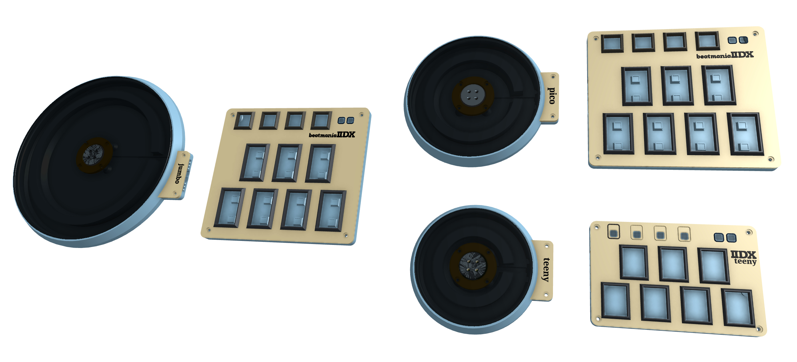

<video src="https://user-images.githubusercontent.com/11623830/229287886-d01893c5-04b6-41fc-a178-72c815e28c96.mp4" controls="controls" width="50%"></video>

Features:
* It's thin, really thin.
* Turntable and keyboard are detachable with magnetic connector, hotswap!
* HID lights, of course!
* Multiple turntable effects.
* Many live settings.
* All source files open.

Thanks to many respectful guys/companies who made their tools or materials free or open source (KiCad, OpenSCAD, InkScape, Raspberry things).

## Caution
This is a difficult build, much more difficult than my previous Pico Popn project:  
https://github.com/whowechina/popn_pico.  
I suggest you to build my Pico Popn first.  
This Pico IIDX project:  
* Heavily depends on 3D printing, both FDM and SLA (resin).
* Requires skills to solder tiny components and thin cables.

Move forward only if you're REALLY interested.  

## **Disclaimer** ##
Due to my limited personal time, this document is still in progress. So stay tuned!  
This project already has a working "release" but I haven't make it a real release yet. There will be updates to all components and firmware as I'm trying to make it better. Luckily, there hasn't been any big mistakes so far. But still there's a chance I will make some, which may lead to your time or money loss. This open source project is provided as is, I can't promise anything.  
Please don't hate me.

## HOW TO BUILD
### Turntable Materials
* 1x AS5600 hall angular sensor board set (23mm\*23mm)  
  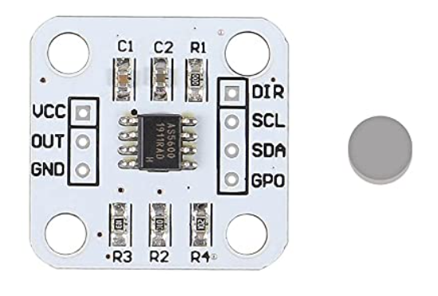
* 1x 6mm\*2mm magnet (must be radially magnetized), normally comes with the AS5600 board set.
* 1x 61804-2RS deep groove ball bearing (20x32x7mm), normally < 5US$;
* 1x WS2812B LED ring board, or RGB LED strip (recommended). Choose ones with dense LED arrangement (>=32 LEDs per board, or >90 LEDS per meter);
* 3x M4*10mm screws (large flat head is better) and hex nuts, for bearing.
* 4x M3*12mm screws, for spinning disc. 
* 1x REF3030 (3.0V Voltage Reference, SOT-23-3).
* 1x Custom cut black acrylic disc, 4mm thickness.
* 11x 12mm non slip self-adhesive silicon pads (also for Keyboard).  
  https://www.amazon.com/Cabinet-Dampening-Adhesive-Circular-Stoppers/dp/B07XXWG818

### Keyboard Materials
* 1x Raspberry Pi Pico.  
  https://www.raspberrypi.com/products/raspberry-pi-pico
* 11x Kailh Choc v1 or v2 key switches, to get better play feel, 7 of them should be 50g linear.  
  https://www.kailhswitch.com/mechanical-keyboard-switches/low-profile-key-switches/burnt-orange-switch.html  
  https://www.kailhswitch.com/mechanical-keyboard-switches/key-switches/kailh-low-profile-switch-choc-v2.html
* 7x Kailh low-profile stabilizers.  
  https://chosfox.com/products/kailh-1350-choc-switch-6-25u-stabilizer-set
* 2x Panasonic 6mm square tactile switch EVQP1K05M.  
  https://www3.panasonic.biz/ac/e/dl/catalog/index.jsp?series_cd=3473&part_no=EVQP1K05M
* 1x USB Type-C socket (918-418K2023S40001 or KH-TYPE-C-16P)
* 11x WS2812B-3528 RGB LEDs or if you want more challenge: 28x WS2812B-1516.
* 2x SN74LV1T34DBVR (SOT-23-5) level shifter, optional, for better voltage tolerance.
* 2x 0603 10ohm resistors to bypass said level shifters, optional.
* 1x 0603 5.1kohm resistors for USB.
* 1x 0805 1nF capacitor for filtering analog signal, optional.
* 5x 0805 1uF capacitors.
* 4x Kailh low-profile keycaps.
* 4x M3*6mm screws and hex nuts to fix parts together.

### Detachable Cable
* 1x HDMI cable (ultra slim, diameter < 4mm), at least 50cm in length, we'll cut the HDMI connectors off, so pick a cheap one.
* 2X Magnetic pogopin connector sets, male and female. PCB side should use ones with 90-degree pins, cable side use ones with straight pins.  
  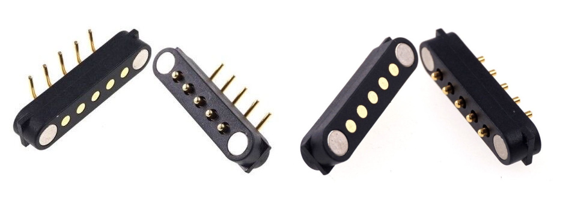

### Step 1 - Buy
* Keyboard PCB  
  Just go [JLC](https://jlcpcb.com/) and make the order. Make sure the board thickness is **1.2mm**, it's very important!
* Turntable PCB  
  It's an optional one. It makes the wiring and soldering inside the turntable a litter easier.
* Acrylic disc  
  Choose the dxf file according to your disc size and find a vendor to cut the 4mm black acrylic.

### Step 2 - 3D Print
#### Keyboard
* PCB bottom (pcb_bottom_*.stl, choose one according to your connector choice)  
  FDM, PLA/PETG transparent, 0.2mm layer, 4 walls.
* PCB top (pcb_top.stl)  
  FDM, PLA transparent, 0.2mm layer, 4 walls.  
  If you have Bambu Lab's AMS system, use PLA black/gray for 3.0mm+ layers.

#### Turntable 
For following prints, FDM, PLA, 0.4 nozzle, 0.16-0.2mm layer, 4 walls.  And very important: "Seam Position" should be set to "**Random**" in your slicer, not only it looks better, it makes the bearing-flange coupling smoother and tension distributed more evenly.  
These are all printed with
* Base (TT_base_xxx.stl), choose one of the 150, 170 or 180, based on your choice of disc size, 20-60% fill.
* Bearing seat (bearing_seat_6804.stl), 20-60% fill.
* Flange for disc (TTshaft_6804.stl), 60% fill.

#### Pogopin Connector
It's very small and requires higher accuracy.
* Housing for pogopin connector (pogo_bottom.stl, pogo_top.stl).  
  FDM, PLA, **0.2 nozzle** is recommended, 0.1mm layer, 4 walls, 60% fill.

#### Button keycaps  
  * Option 1 (Choc V1 or V2): SLA (resin), regular white, 0.05mm layer, check out my orientation:  
  
  * Option 2 (Choc V2 only): FDM, PLA white, 0.2mm nozzle recommended but 0.4mm nozzle works too, 0.10~0.16mm layer, use easy-to-remove material for support, like "Bambu Support W" or just PETG.  
  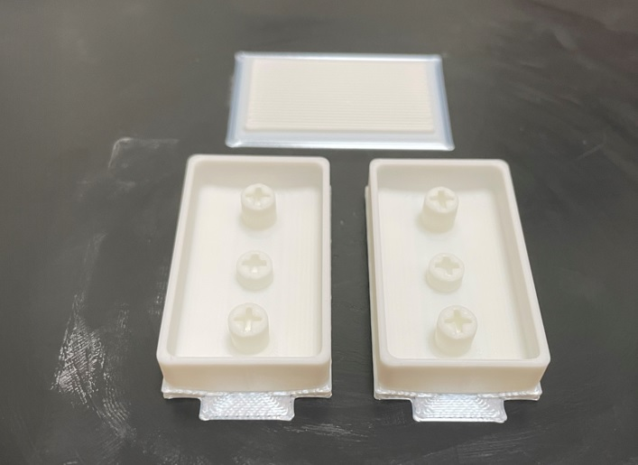
  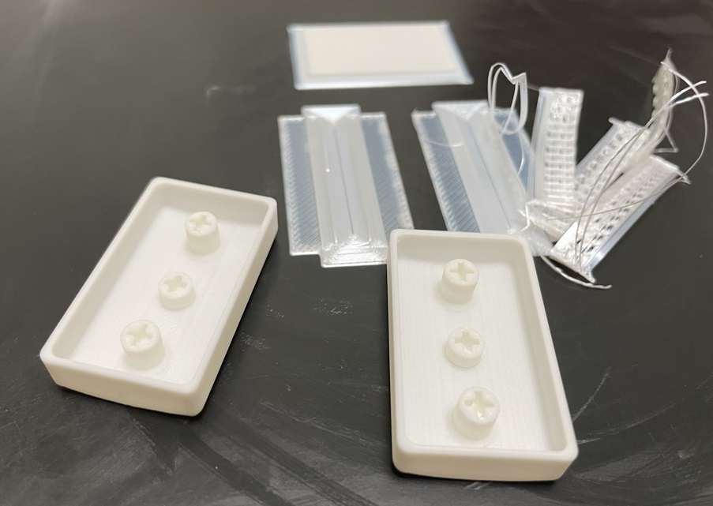

### Step 3 - Solder
* Keyboard  
  * WS2812 choices for main 7 main keys, for each key: solder 1x WS2812B-3528 under the key switch, or 4x WS2812-1516 around the key switch.
  * IMPORTANT: be careful about the orientation of LEDs, they're different at different rows or columns.  
    
    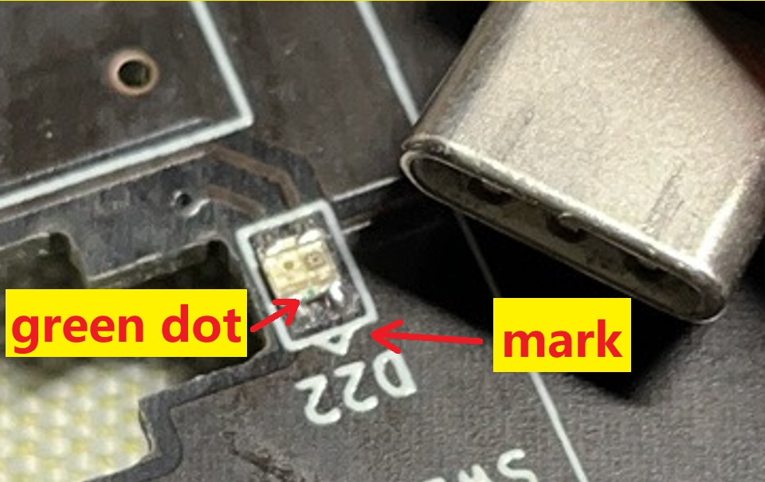
  * Connector choices: solder 2x pogopin connectors, or solder 1x 3.5mm headphone input jack.
  * It's very easy to miss the USB pins of the Raspberry Pico Pi, it's at the other side. And it's difficult to solder as you may leave an airbubble in the soldering hole. My trick is to use sharpest iron tip, super-slowly apply solder wire only at one side. This is my result:  
  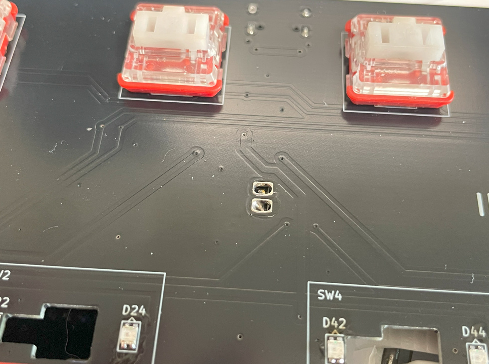
  * You can use level shifter (SN74LV1T34DBVR), or you can just bypass it by soldering a nearby resistor (10 ohm), or in early PCB version, short the two pads following the picture below.   
    
  * IMPORTANT: leave R1 unsoldered.
  * Optional: TVS1 and TVS2 are rated 3.3V, protecting GPIOs. TVS3 should be rated 5V when using level shifter, and 3.3V when not using level shifter.
* Turntable
  * General  
  Typical AS5600 development board comes with 3.3V configuration, we can't feed 5V to it directly, it would burn the AS5600 or the main Pi Pico. The GPIO we use to communicate with AS5600 can never go beyond 3.6V. So we need a lower voltage, I chose REF3030, a precise 3.0V voltage reference.  
  You need to scrape off some solder mask to expose the ground copper (don't scrape the solder mask under 5V pin). I found a good place to mount the REF3030, this is how I handled it:  
  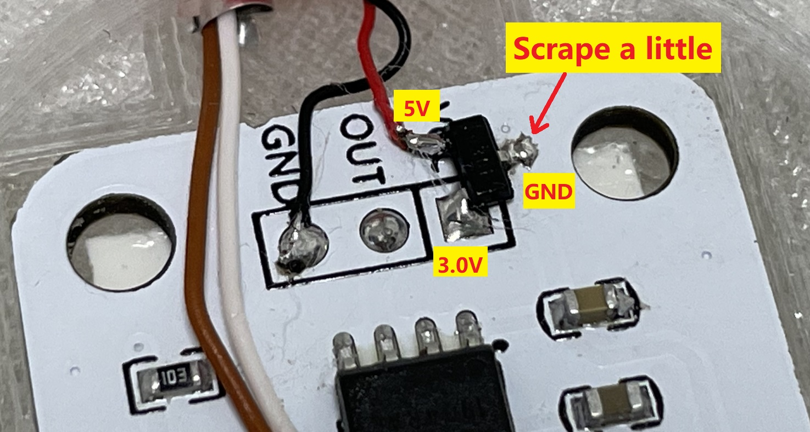

  * If you go with digital (magnetic pogo pin connector)  
  There're a set of I2C and a WS2812B signal line together in the cable that connects turntable and the keyboard. Unfortunately, these signals crosstalk. So, we have to use shield cables for them. Two I2C lines should have a shield cable, and the WS2812B signal should have another shield cable. Good thing is, an HDMI cable has 4 shield cables and bunch of other small cables. We can make use of it.  
  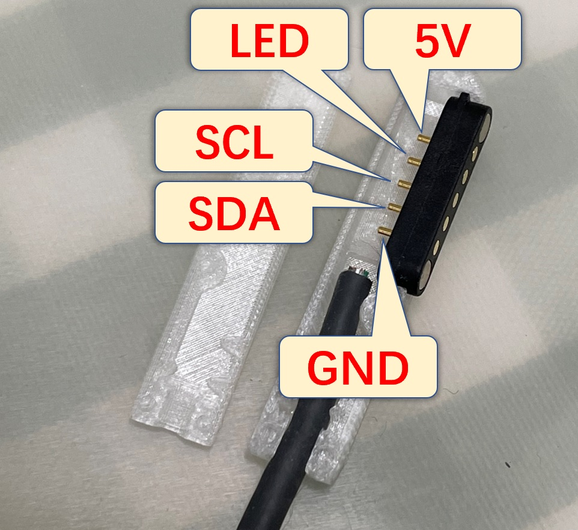  

  * If you go with analog (3.5mm headphone jack)  
  Here's the pin definition.  
  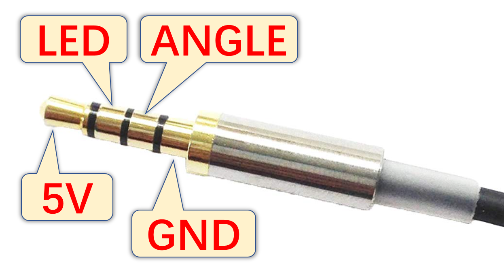  
  The "ANGLE" connects to the AS5600 analog OUT. You need to remove a resistor from as5600 board to get OUT pin working.  
  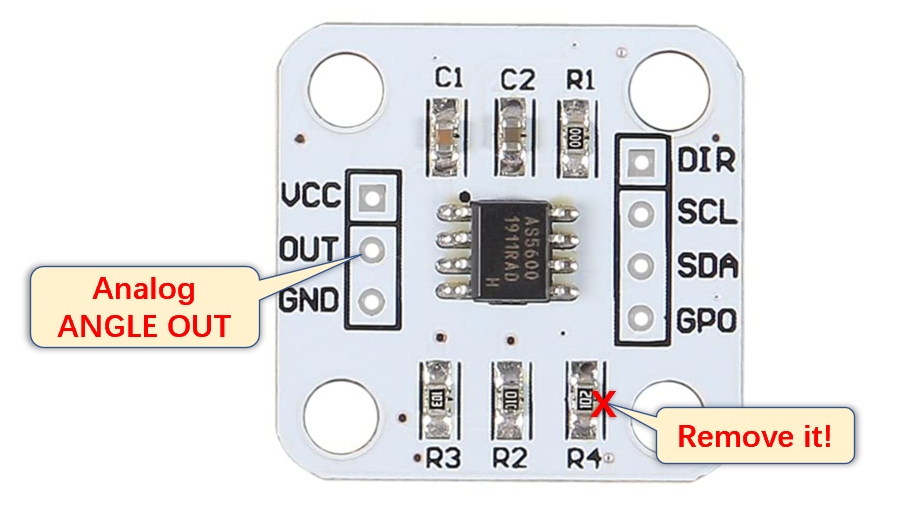

  Note: For analog, crosstalk maybe no longer an issue, but ground level becomes a new concern. When driving the turntable LED ring, there's a considerable amount of current travelling through the ground cable which lifts AS5600 ground level. There're two ways to handle this. 
    * One is to use a 5 wire cable. You need to separate LED ground from the sensor ground. A typical Type-C to Type-C cable has 5 wires inside. You can use red and black to power the LED and others to serve sensor ground, sensor analog out and LED signal.  
    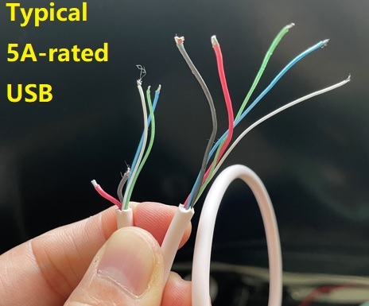
    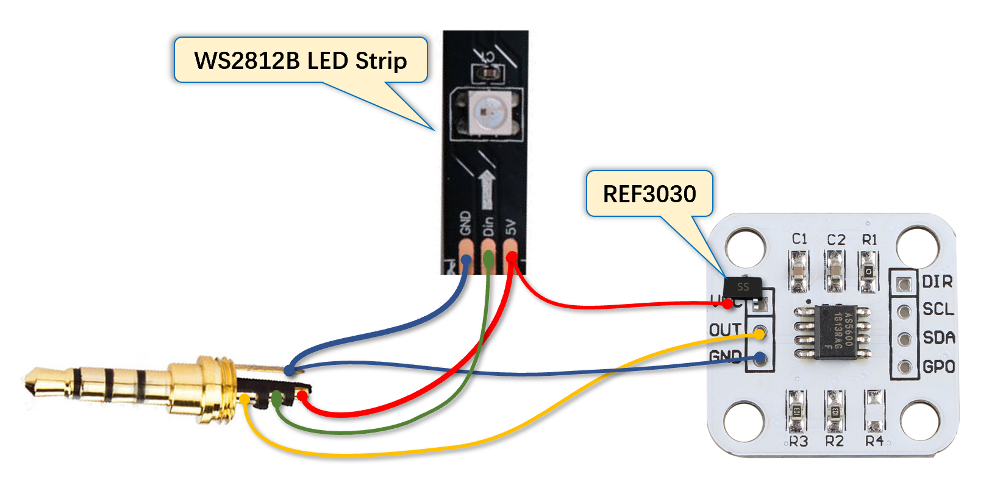

    * The other one is to minimize the ground wire resistance. A metal braid shielding cable can be used with the metal shield serving as the ground line. Or you can find a 4 wire cable with thick core copper.
* Turntable LED Ring  
  I recommend to use LED strip over LED board, becuase the LED board's light is facing up, but using strip, the light can spread out pefectly.  
  Use transparent double-sided tape to stick the LED around the turntable inner wall.
### Step 4 - Assemble
* Assemble the turntable  
  I don't know how to draw an explosion diagram, this is done by coding in OpenSCAD:  
  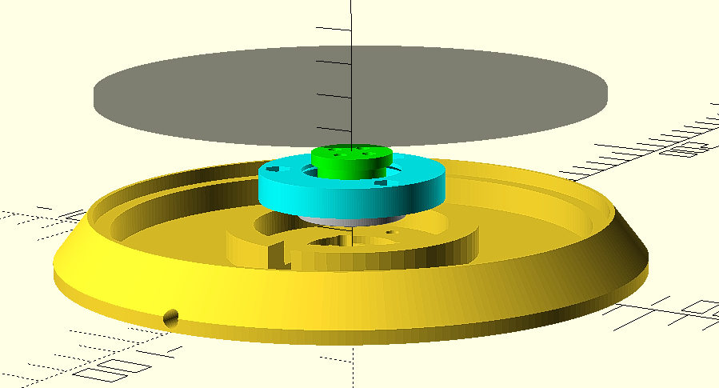  
  These shows how a bearing is installed.  
  
  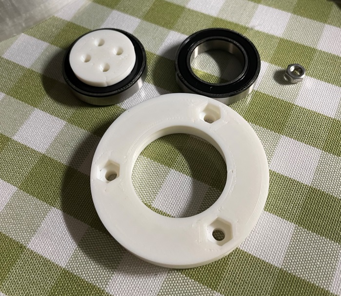
  
  
  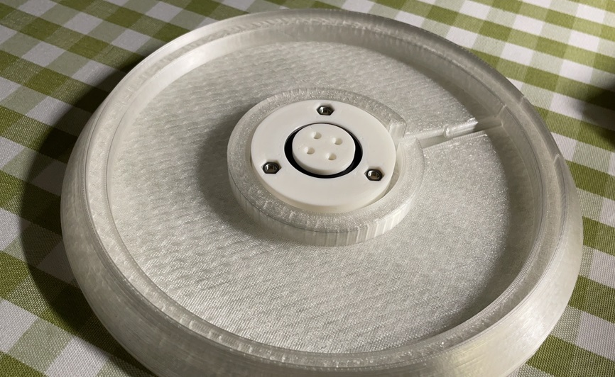

* Install the low-profile stabilizers.  
  https://docs.keeb.io/choc-stabs  
  A little trick here. As the PCB footprint is made to support both choc v1 and v2, that leaves some wobble space for choc v1 and makes it difficult to align. So leave the key switch unsoldered, when the stabilizer, the key switch and the keycap are all in place, push the keycap down and then solder the key switch. This way the key switch will be aligned to the stabilizers better.
* Assemble the keyboard  
  It's very easy.  
  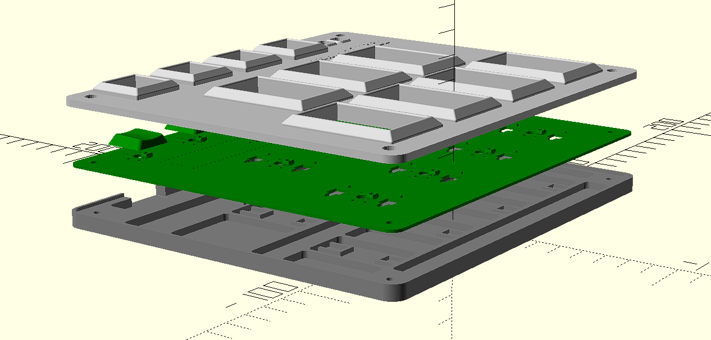  
  
  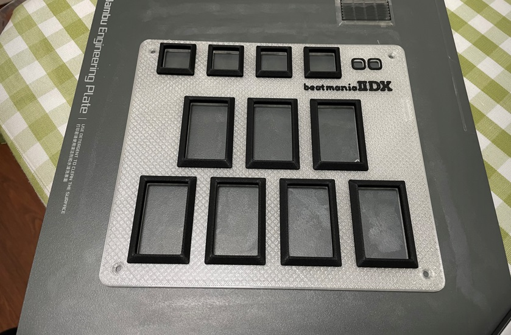
  
  
  

### Step 4 - Firmware
* For the new build, hold the BOOTSEL button while connect the USB to a PC, there will be a disk named "RPI-RP2" showed up. Drag the uf2 firmware binary file into it. That's it. There's a small hole at the back side of the keyboard, it is facing right to the BOOTSEL button.
* If it is already running my IIDX firmware, hold two small AUX buttons together will do the same as the BOOTSEL button.
* For now, some configurations are hardcoded, if you want to change something, you need to build by yourself.

### What If?
* I can't find pogopin connector.  
**Solution:** I figured out another connector choice, which is a 3.5mm 4P headphone jack. It uses analog to communicate turntable movements, but I'm still testing it, so stay tuned. I will update this document.
* I don't have Bambu Lab's machine, or I don't have an AMS system.  
**Solution:** There're many online vendors and people providing paid Bambu printing service. Or you can just use other 3D printers. It's just the numbers in the OpenSCAD source file or STL files are finetuned on my Bambu Lab X1. You may need to adjust a little on your 3D printer system to get perfect result. And regarding the multi-color thing, maybe you can just paint the top layer by hand. I know people do miniature painting, I think it would be similar.
* STL files are not accurate, difficult to assemble.  
**Solution:** 3D printer systems are different one from another, it results in small differences even with same model file and some configuration. If the printed parts are not happy with each other, you can fiddle with the OpenSCAD source file and the numbers in it for your case.
* I don't have resin printer.
* I can't find Kailh low-profile stabilizer.
* I don't have electronic DIY gears.  
**Solution:** OK, this is an electronic hobby project, maybe it's not for you if you don't plan to do electronic DIYs. There're many good IIDX controllers you can purchase somewhere online.
