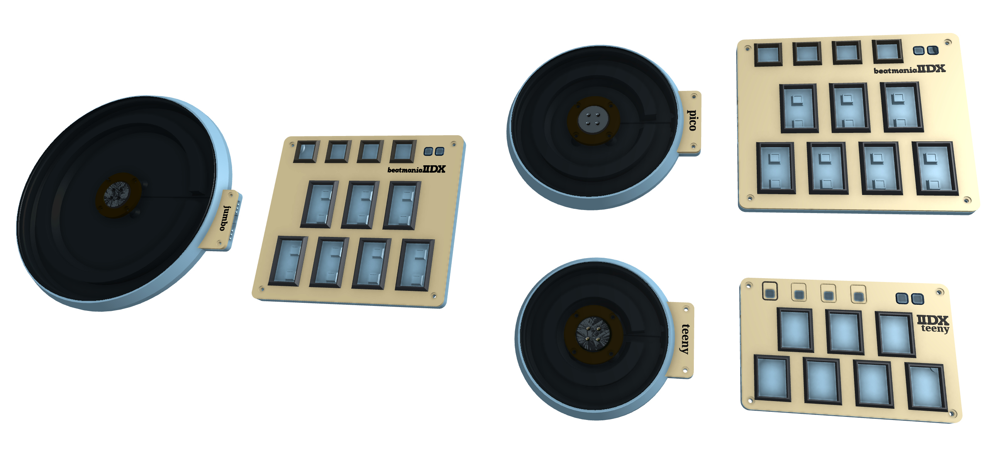

# IIDX Pico - Beatmania IIDX 风格的迷你控制器
[Click here for the English version of this guide.]（README.md）

## 敬请期待
* IIDX Pico 经过重构，现在更加易于制作。
* IIDX Pico, IIDX Teeny 和 IIDX Jumbo 三个变种都会整合到本仓库，以便更好地管理。原先的 IIDX Teeny 仓库则会封存，不再更新。
* 老的文件已经转移到 Gen1Archive 目录，当然也可以在历史版本中找到。
* 新的文档还在撰写中，所以请耐心等待。

## 感谢
感谢许多尊敬的爱好者和公司将他们的工具或材料免费或开源（KiCad，OnShape，InkScape，Raspberry 相关工具, 嘉立创，等）。

特别感谢社区项目和开发者的帮助，还有如下项目：
* RP_Silicon_KiCad: https://github.com/HeadBoffin/RP_Silicon_KiCad
* Type-C: https://github.com/ai03-2725/Type-C.pretty

## 其他项目
你也可以查看我其他的酷炫项目。

           

* Popn Pico: https://github.com/whowechina/popn_pico
* IIDX Pico: https://github.com/whowechina/iidx_pico
* IIDX Teeny: https://github.com/whowechina/iidx_teeny
* Chu Pico: https://github.com/whowechina/chu_pico
* Mai Pico: https://github.com/whowechina/mai_pico
* Diva Pico: https://github.com/whowechina/diva_pico
* AIC Pico: https://github.com/whowechina/aic_pico
* Groove Pico: https://github.com/whowechina/groove_pico
* Geki Pico: https://github.com/whowechina/geki_pico
* Musec Pico: https://github.com/whowechina/musec_pico
* Ju Pico: https://github.com/whowechina/ju_pico

## **声明** ##
我在个人时间内制作了这个项目，没有任何经济利益或赞助。我将继续改进这个项目。我已尽我所能确保所有内容的准确性和功能性，但总有可能出现错误。如果你因使用这个开源项目而造成时间或金钱的损失，我不能负责。感谢你的理解。

## 关于许可证
它是 CC-NC 授权。所以你只能给自己和你的朋友 DIY，不能利用这个项目赚钱，比如收费的代做，出售整机等，连源作者都不敢提的抄袭或者稍微改改换个名字来打擦边球就更不可以了。注意团购和拼单订购原始元器件是合理的，非盈利的方式卖掉剩余的元器件也是可以接受的。

如果希望找我购买成品或者获取商用授权，请联系我（Discord，QQ 群，闲鱼，微信群或者在 issue 区留下你的联系方式）。

## 我的 Discord 服务器邀请
https://discord.gg/M8f2PPQFEA

## 如何制作
### 转盘需要的材料
* 1x 5mm\*2mm 圆形磁铁，必须是径向充磁的。
* 1x 61804-2RS 深沟球轴承 （20x32x7mm），选便宜的即可。
* 2x 6705-2RS（替换方案）深沟球轴承（25x32x4mm），仅适用于 IIDX Jumbo，摆动更小.
* 1x WS2812B LED RGB 灯带。请选择灯珠密集的型号。对于 IIDX Pico 和 IIDX Jumbo，我推荐每米 80 个以上灯珠；对于 IIDX Teeny，我推荐每米 120 个以上灯珠。
* 1x M2.5*6 螺丝和六角螺母，用来把转盘座，磁铁座和轴承固定在一起。
* 4x M3*8mm 螺丝，用于把轴承座固定到底座。
* 4x M3*12mm 螺丝，用于固定转盘。
* 2x M3*8mm 螺丝和六角螺母，用于固定标志面板。
* 1x 为 IIDX Pico 或者 IIDX Jumbo 切割的黑色亚克力转盘。
* 一些 10mm 直径的防滑硅胶垫，同样也用于键盘部分。
* 硅胶管，内直径 25mm，外直径 27mm，用来当作铰链。
* 较软的排线，需要 7 根线并排在一起。建议使用 28AWG 粗细的硅胶排线。
* 一些布基的醋酸胶带，用来固定电线。

### PCB 和键盘部分的材料
* 1x 树莓派 Pico 或 Pico W。  
  https://www.raspberrypi.com/products/raspberry-pi-pico
* 11x 凯华巧克力 V1 或者 V2 键盘矮轴。我建议给 7 个主按键使用线性轴体。  
  https://www.kailhswitch.com/mechanical-keyboard-switches/low-profile-key-switches/burnt-orange-switch.html  
  https://www.kailhswitch.com/mechanical-keyboard-switches/key-switches/kailh-low-profile-switch-choc-v2.html
* 7x 凯华矮轴巧克力 V1 的卫星轴。  
  https://chosfox.com/products/kailh-1350-choc-switch-6-25u-stabilizer-set
* 2x 松下 EVQP1K05M 微动开关，仅针对 IIDX Pico 和 IIDX Jumbo。  
  https://www3.panasonic.biz/ac/e/dl/catalog/index.jsp?series_cd=3473&part_no=EVQP1K05M
* 6x 松下 EVQP1K05M 或 ALPS 的 SKPMAPE010 微动开关，仅针对 IIDX Teeny。  
  https://www3.panasonic.biz/ac/e/dl/catalog/index.jsp?series_cd=3473&part_no=EVQP1K05M  
  https://tech.alpsalpine.com/e/products/detail/SKPMAPE010/
* 1x USB Type-C 插座（918-418K2023S40001 或 KH-TYPE-C-16P）。
* 1x AS5600（SOP8） 或者 TMAG5273（SOT23-6） 霍尔角度传感器芯片。
* RGB LED 灯
  * IIDX Pico 和 IIDX Jumbo（光效更好的方案）
    * 28x WS2812B-1516 或 WS2812B-2020 LED 灯珠，用于主按钮，引脚顺序必须是下图所示这种。  
    
    * 4x WS2812B-3528 （也叫 WS2812B-2835），用于辅助按钮。
  * IIDX Pico 和 IIDX Jumbo （好焊省事的方案）
    * 11x WS2812B-3528 （也叫 WS2812B-2835），就不需要焊那 28 个超小的 LED 了。
  * IIDX Teeny
    * 18 WS2812B-3528 （也叫 WS2812B-2835）。
* 4x 0603 5.1kohm 贴片电阻，用于 USB 口和 I2C 上拉。
* 6x 0603 0.1uF 电容，用于 IIDX Pico 和 IIDX Jumbo；IIDX Teeny 只需要 4 颗。
* 4x 凯华矮轴 1U 键帽，仅适用于 IIDX Pico 和 IIDX Jumbo。
* 4x M3*8mm 螺丝和六角螺母，用于固定外壳。

### 第一步 - 购买
* 主 PCB  
  到 [嘉立创](https://jlcpcb.com/) 或者你喜欢的其他 PCB 厂商下单。请确保板厚为 **1.2mm**，这一点非常重要！
* IIDX Pico 和 IIDX Jumbo 用的亚克力转盘。   
  你需要找到一个亚克力供应商，然后使用对应的文件来切割亚克力转盘，请使用 3mm 厚度的黑色亚克力板材。  
  你也可以 3D 打印转盘，但是它们容易变形。

### 第二步 - 3D 打印
#### 键盘部分
下面部分，FDM 打印，PLA，0.4 喷嘴，0.2mm 层厚。
* 键盘底座（"Keyboard Base *.stl）, PLA/PETG 透明，2 到 3 层墙。
* 键盘面板（"Keyboard Panel.stl"）, PLA/PETG 透明，2 到 3 层墙，如果你有多色打印系统，请用黑色材料来打印面板装饰和文字部分（高度 3mm 以上部分）。

#### 转盘部分 
下面部分，FDM 打印，PLA，0.4 喷嘴，0.2mm 层厚，3 到 4 层墙。
* 底座（"Turntable \* - Base.stl"）, 20-40% 填充率。
* 轴承座（"Turntable - Bearing Seat"）, 40% to 60% 填充率。
* 磁铁座（"Turntable - Magnet Seat"）, 40% to 60% 填充率。
* 转盘座（"Turntable - Disc Seat"）, 40% to 60% 填充率。
* IIDX Teeny 用的转盘（"Turntable Teeny - Disc"），80% 以上的填充率，选择同心圆纹路并使用纹理 PEI 打印平台来获得更好的表面效果。
* 标志面板（"Turntable * - Banner"）, 20-40% 填充率。如果你有多色打印系统，请用黑色材料来打印文字部分。
* 提醒：用于 IIDX Jumbo 双轴承版本的文件，文件名里带有 "Jumbo 2B" 字样。
* IIDX Jumbo 和 IIDX Pico 也可以打印转盘，但是它们容易变形，请优先选择前面提到的亚克力方案。

#### 键帽
* 键帽（"Keycap *.stl"）, 推荐树脂打印，但是普通 FDM 打印也能用。

### 第三步 - 焊接和组装的提示
* 键盘部分
  * 树莓派 Pico 的两个 USB 引脚很容易被忽略，它们在另一侧，比较很难焊接，且容易在焊接孔中留下气泡。一个小技巧是使用最尖的焊铁头，缓慢的上锡。  
    
  * 一旦你焊接好了 Pi Pico，你就可以上传固件并测试键盘了。请在焊接和组装过程中频繁测试。
  * 主 PCB 上有两个小的传感器板，一个是给 AS5600 用的，另一个是给 TMAG5273 用的。你只需要其中一个。测试成功后，你可以把它割下来，后面要装到转盘上。
  * 这个游戏手柄测试页面可以用于测试。你可以在 AS5600 或 TMAG5273 上移动螺丝刀头来看看轴的移动。  
    https://greggman.github.io/html5-gamepad-test/
  * 参考这个文档来安装矮轴卫星轴。  
    https://docs.keeb.io/choc-stabs  
    这里有个小技巧。因为 PCB 的焊盘是支持巧克力 V1 和 V2 的，所以对于巧克力 V1 会有一些摇摆空间，这样就很难对齐。所以先不要焊接轴体，当卫星轴，轴体和键帽都安装好后，键帽按到底，然后焊接轴体。这样就会更好的对齐。

* 转盘
  * 这部分的安装参考下图，比较简单。  
      
    
  * 传感器板用薄的双面胶贴在底座上。
  * 对于 IIDX Jumbo 的双轴承版本，你需要把两个 6705-2RS 轴承堆叠在一起。
  * 轴承原本摩擦很小，如果需要更多阻尼，可以加一些中等粘度的阻尼脂，但不要加太多。轴承型号中的 "2RS" 表示它是橡胶密封的，所以很容易打开橡胶盖并加入阻尼脂。
  * RGB LED 灯带粘在圆形 LED 墙上，顺时针或者逆时针都可以。
  * 7 线的排线，其中 3 线用于 RGB 灯带，另外 4 线用于传感器板。  
    
  * 硅胶管用来作为铰链连接转盘和键盘，排线会从管子穿过。你需要一个 7mm 或者 8mm 的打孔器在硅胶管上打孔，以匹配转盘底座和键盘两侧的挂钩。

### 固件
* UF2 文件在 `Production\Firmware` 文件夹中，IIDX Pico/Teeny/Jumbo 共享同一个 IIDX Pico 固件。
* 首次烧写，请按住 BOOTSEL 按钮连接到 USB，会出现一个名为 "RPI-RP2" 的磁盘。将 UF2 固件二进制文件拖入其中。注意 IIDX Pico/Teeny/Jumbo 的底部有一个小孔，它正对着 BOOTSEL 按钮。
* 如果已经烧录过 IIDX Pico 固件，你可以使用命令行中的 "update" 或者在插入 USB 的时候按住两个 AUX 按钮来进入更新模式。
* 要访问命令行，你可以使用这个 Web 串口终端连接到 IIDX Pico 的 USB 串口。（注意："?" 是帮助）  
  https://googlechromelabs.github.io/serial-terminal/
* 刚装好的时候，需要设置一下转盘的 LED 灯数量，具体参考手册中的 SETUP 模式。
* 你可以设置灯光亮度，转盘灯效主题，按键灯效主题。
* [Nice Looking Manual Here]（doc/Firmware_manual.pdf）  
  

## CAD 源文件
我使用的是 OnShape 的免费订阅。它很强大，但不能将原始设计存档到本地，所以我只能在这里分享链接。STL/DXF/DWG 文件是从这个在线文档导出的。  
https://cad.onshape.com/documents/ed99bfa5b4aec5d3ea6e6ed6/w/9a87f8b714078597b4ef5e3c/e/2e27bace5a421a921473c027
